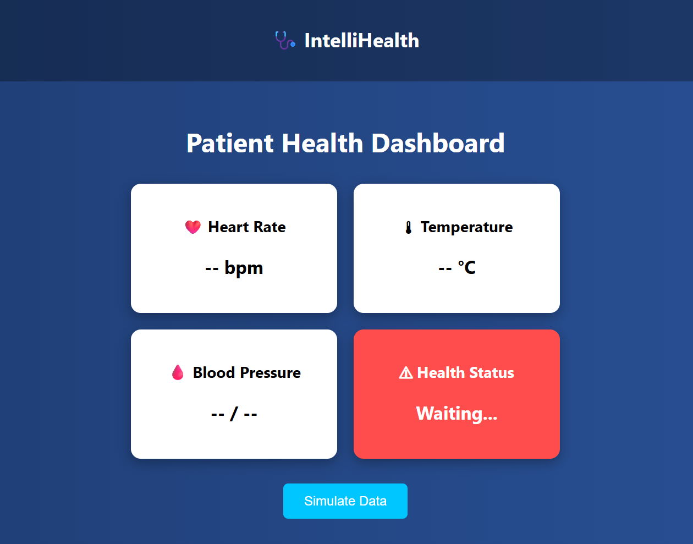
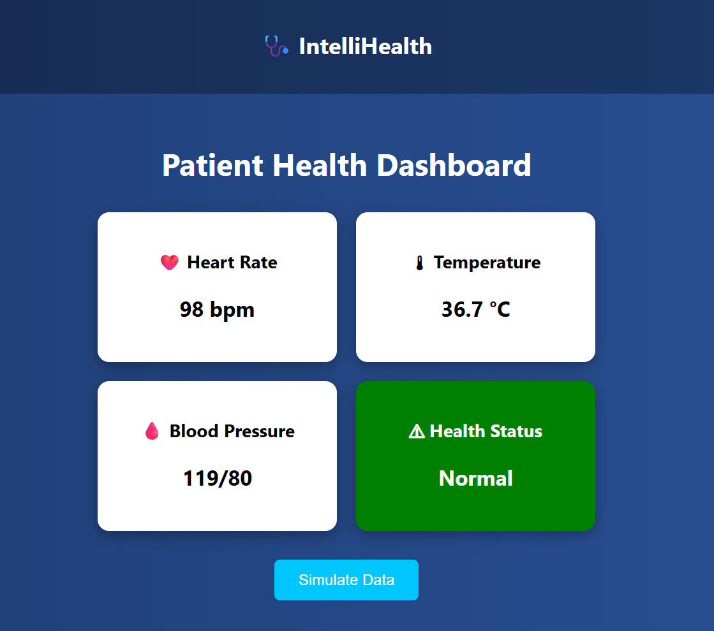
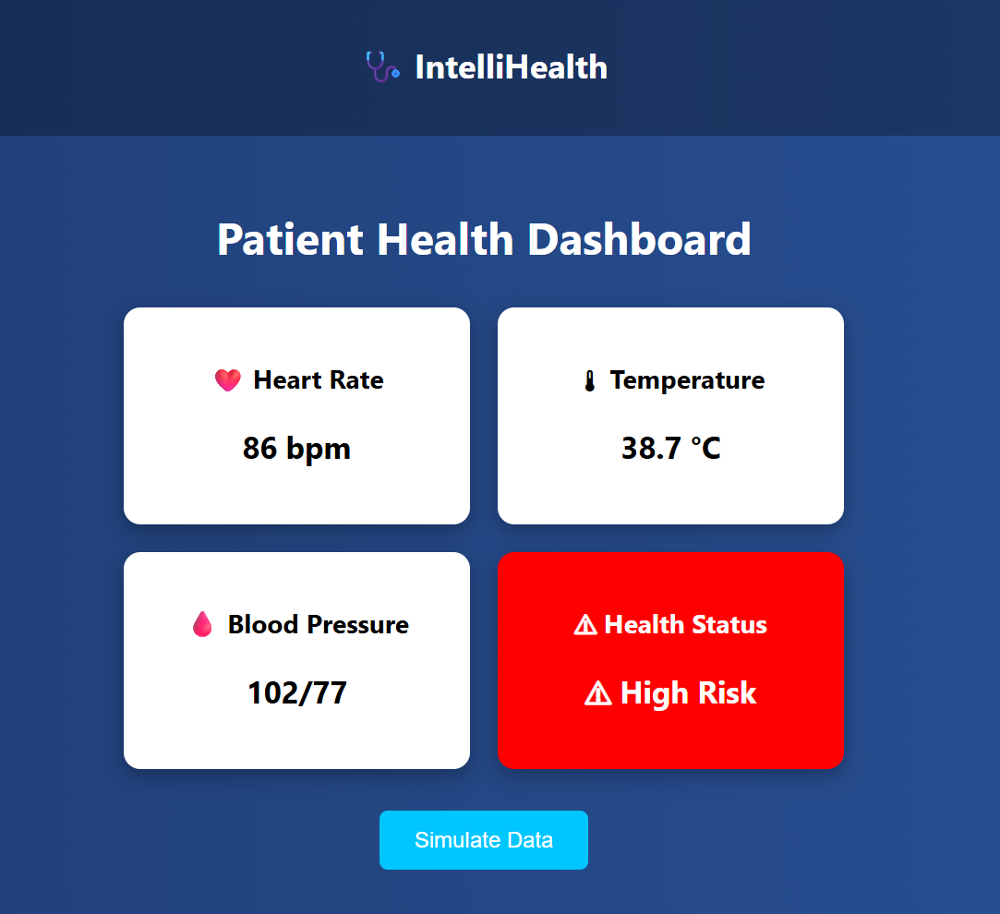

# 🩺 IntelliHealth – AI-Based Smart Health Monitoring System

## 📌 Introduction
IntelliHealth is an AI-based smart health monitoring system that simulates real-time patient health data and predicts potential health risks. It provides a modern dashboard interface to visualize vital parameters like heart rate, temperature, and blood pressure.

---

## ❗ Problem Statement
- Lack of real-time health monitoring  
- Delayed detection of health issues  
- Manual tracking is inefficient  
- No predictive healthcare insights  

---

## 🎯 Objective
- Monitor health parameters dynamically  
- Predict health risk using AI logic  
- Provide an interactive dashboard  
- Improve healthcare awareness  

---

## 💡 Proposed Solution
IntelliHealth is a web-based dashboard that simulates patient health data and uses AI-based logic to detect abnormal conditions. It provides alerts and visualizations to help understand health status easily.

---

## 🛠 Tech Stack
- **Frontend:** HTML, CSS, JavaScript  
- **Visualization:** Chart.js  
- **AI Logic:** Rule-based health risk detection  

---

## ✨ Key Features
- Real-time health data simulation  
- AI-based health risk prediction  
- Interactive dashboard UI  
- Graph visualization of health metrics  
- Alert system for abnormal conditions  

---

## 📊 Screenshots

### 🔹 Dashboard View


### 🔹 Simulation Result 1


### 🔹 Simulation Result 2


---

## 🚀 Advantages
- Early detection of health risks  
- Easy-to-use interface  
- Real-time visualization  
- Cost-effective solution  
- Scalable for future enhancements  

---

## 🌍 Applications
- Hospitals and clinics  
- Remote patient monitoring  
- Wearable health systems  
- Smart healthcare solutions  

---

## ▶️ How to Run the Project

1. Open terminal in project folder:
   ```bash
    cd IntelliHealth
  
2. Run using browser:
   ```bash
     start frontend/index.html

   
3. OR     Run using local server:
    ```bash
    cd frontend
    python -m http.server 8000
    
4. Open in browser:
    ```bash
    http://localhost:8000


📌 Conclusion

IntelliHealth demonstrates how AI and modern web technologies can be used to monitor and predict health conditions effectively. It helps in early detection and improves healthcare efficiency.

👨‍💻 Author

Y.M.V. SHIVARAM
 

